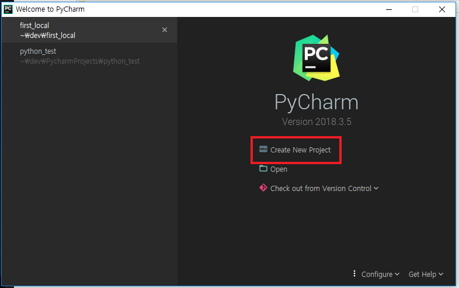
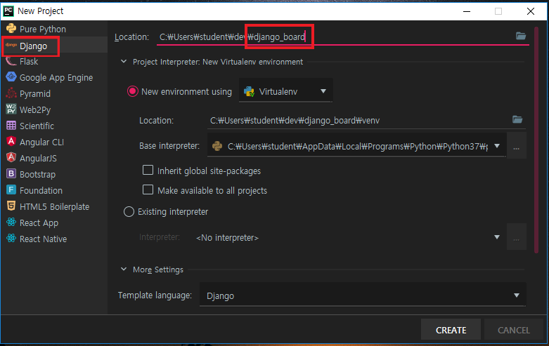
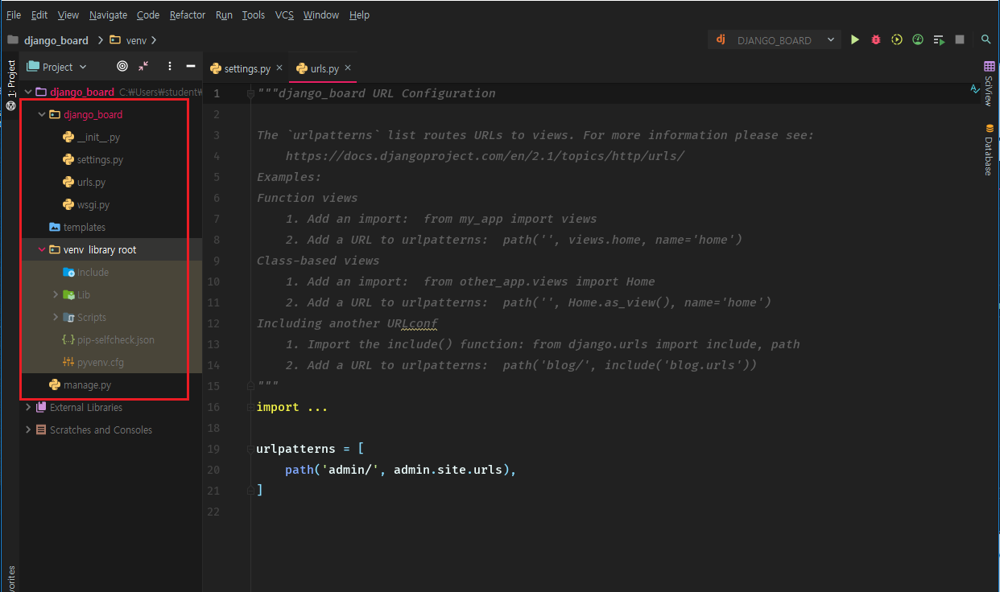
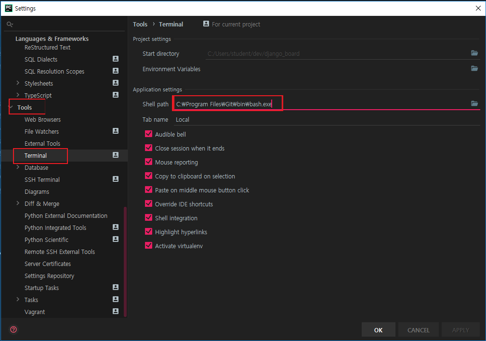
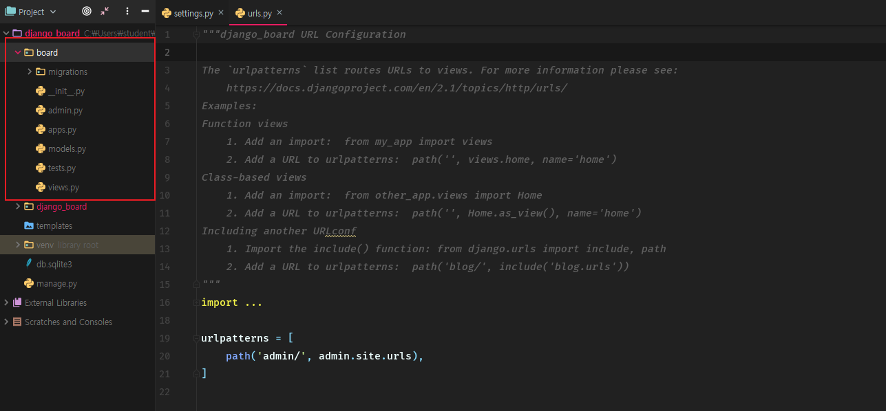

# django를 사용해 게시판 만들기

python 웹 프레임워크 django를 사용하여 게시판을 만들어 보겠습니다.

이번 포스팅은 어느정도 python에 익숙하신 분들이라면 쉽게 이해할 수 있는 내용입니다.


## I. django

일단 django가 무엇이고 어떤 기능을 하는지 알아봅시다.


### django란?

- 웹 서비스를 쉽게 만들 수 있도록 도와주는 프레임워크
- 기본적으로 웹 프로그래밍을 하는데 도움을 주는 기능과 구조 제공


우리가 직접 웹 사이트를 구현한다고 생각해봅시다. 모든 메서드와 환경을 직접 구성하려면 너무 많은 시간과 노력을 들여야 하며 결과 또한 그렇게 좋지 않을겁니다. 그래서 라이브러리와 프레임워크를 사용합니다.

프레임워크란 개발을 하는데 필요한 기능과 뼈대를 제공합니다. 라이브러리와 헷갈릴 수 있는데, 라이브러리는 **이미 정의된 기능**을 제공하는 개념이고, 프레임워크는 어떤 프로그램을 만들기 위한 **기본구조, 뼈대, 기능**을 모두 제공하는 개념입니다.

물론 라이브러리 만으로도 웹 개발을 할 수 있을 것입니다. 하지만, 기본 구조 또한 제공된다면 더욱 **정확한 구조**로, **쉽게** 웹 개발이 가능하므로 우리는 프레임워크를 사용하여 개발하겠습니다.


## II. 개발 환경 세팅

저는 IDE는 pycharm을 사용하여 개발을 진행하겠습니다. 먼저 pycharm을 설치하고 시작하겠습니다. pycharm은 https://www.jetbrains.com/pycharm/ 에서 다운받아 사용할 수 있습니다.


설치를 한 후 설정을 하고 pycharm을 실행하면 다음과 같은 화면을 볼 수 있습니다.



create를 눌러 새로운 project를 생성하는 화면으로 넘어가면




다음과 같이 여러 python 기능을 선택할 수 있는 과정이 나옵니다. 우리는 django를 사용할 것이므로 django를 선택하고 location 부분에서 프로젝트 이름을 설정해줍니다.

이후 가상환경과 django가 설치가 되고 프로젝트 메인 화면을 볼 수 있습니다.



여기서 주목할 점은 일반적으로 python 프로젝트를 생성하던 것과는 다르게, 생성하지도 않은 여러개의 파일들이 생성되있는 것을 볼 수 있습니다.

여기서 프레임워크와 라이브러리의 차이점을 다시 설명드릴 수 있는데, 프레임워크는 **개발을 위한 기본 뼈대**를 제공한다고 설명드렸습니다. 생성된 파일들은 **웹 개발을 위해 django가 생성한 파일들**이며 우리는 이 파일들을 조작하여 게시판을 만들어 나갈것입니다.

하지만 모든 파일을 조작하지는 않을 것이고, 필요한 파일만 조작하겠습니다.

여기서 끝이 아니라 한가지 단계만 더 밟고 나가겠습니다. 

먼저 bash설정을 잡고 가겠습니다. `crtl+alt+s` 를 누르면 pycharm 설정창이 나옵니다. 이후 `Tools`의 `Terminal`에 들어가 Shell path 부분을 bash가 깔려있는 경로로 설정해줍니다. git bash가 설치되어 있지 않은 경우 https://gitforwindows.org/ 에서 받아 설치 후 적용하면 됩니다.




다음으로 `alt+F12` 키를 누르면 bash창이 열립니다. bash창에서 다음을 입력해줍니다.

```bash
python manage.py startapp board
```

그러면 다음과 같이 board는 폴더와 내부 파일들이 생성됩니다.



django가 제공하는 기본 뼈대를 넘어 **실제 작동할 어플리케이션을 생성한다는 의미**입니다. 이 명령어는 나중에 다시 더 자세하게 설명하겠습니다.


## III. 프로젝트의 구조

개발을 하기에 앞서 django가 작동하는 구조를 알고 갈 필요가 있습니다. 그 전에, 우리가 조작해야하는 파일과 그 파일들이 어떤 기능을 하는지 먼저 알아보겠습니다.


### (1) manage.py

프로젝트의 모든것을 총괄하는 파일입니다. 어플리케이션 생성, 실행, 관리 등등 개발에 필요한 전반적인 기능을 담당하는 파일입니다. 우리는 이 파일을 조작하지는 않지만, 필요할 때 마다 사용하겠습니다.


### (2) venv

각종 가상환경 설정이 포함된 폴더입니다. 가상환경에 대해서는 나중에 포스팅 하겠지만, 간단하게 설명하자면 개발을 위한 기본적인 라이브러리, 프레임워크만 포함되어 있는 새로운 공간으로 생각하면 되겠습니다.

보통 기본 로컬환경에서는 사용자에 따라 여러 모듈이 설치되어 있을것이지만, 그 모든게 우리에게 필요한 것은 아닙니다. 따라서, 우리는 새로운 개발 공간을 만들어 그 위에서 작업할 것이며, pycharm은 아주 똑똑하게도 이런 기본환경을 제공합니다.


### (3) django_board

우리가 실제 생성한 프로젝트의 이름이며 프로젝트 생성시 기본으로 제공되는 폴더입니다. 내부에는 모든 설정과 실행을 담당하는 파일이 들어있습니다.

#### 1. \__init__.py, wsgi.py

두 파일은 나중에 설명드리겠지만, 일단 두 파일은 당장에 필요하지 않으므로 건드리지 않습니다.

#### 2. settings.py

django 프로젝트의 설정을 담당하는 파일입니다. 프로젝트의 언어, 시간, 파일관리 등등의 설정을 할 수 있습니다. 나중에 하나하나 의미를 설명하겠지만 지금은 일단 언어만 수정하고 가겠습니다.

- LANGUAGE_CODE: django 기본 언어코드를 설정할 수 있습니다. 한국어로 하려면 'en-us'를 'ko-kr'로 바꿔주시면 됩니다.

#### 3. urls.py

나중에 설명드릴 부분이지만, 간단하게 설명하자면 사용자가 요청한 url과 우리가 만든 기능을 연결하는 폴더라고 생각하면 되겠습니다.


### (4) board

우리가 생성한 어플리케이션의 이름이며 어플리케이션 설정, 개발에 관한 파일들이 들어있습니다.

#### 1. \__init__.py, admin.py, test.py, apps.py

당장에 필요한 부분은 아닙니다. 현재는 건드리지 않습니다.

#### 2. views.py

서비스에서 작동할 **웹 서비스의 기능**이 담긴 파일입니다. urls.py에서 url이 지정되면 views에 담긴 메서드를 호출하고 서비스가 작동됩니다. 우리는 주로 이 파일을 조작하며 서비스를 개발해 나갈겁니다.

#### 3. models.py

데이터베이스 모델링에 관한 설정파일입니다. django는 기본적으로 데이터베이스는 sqlite3, ORM은 django ORM을 제공하며, ORM에 관한 model을 정의하는 파일입니다.

#### 4. migrations

models.py에서 정의한 모델에 관한 정보와 기록이 담긴 폴더입니다. 이 폴더는 나중에 model을 생성하며 살펴보겠습니다.


### (5) Template

사용자에게 보여질 html문서를 보관하는 폴더입니다. 웹 서비스는 사용자 요청에 따라 **html 문서 단 하나만** 제공하는 구조입니다. django는 사용자의 요청에 따라 결과를 계산하여 html문서에 담아 사용자에게 전송합니다.


이상으로 프로젝트 생성시에 담긴 파일들의 기능과 역할을 살펴보았습니다. 생성된 파일은 많지만 막상 다뤄야 되는 부분은 그리 많지 않다는 것을 알 수 있습니다. 간단하게 알아보았지만, 다루지 않은 것들은 개발을 진행하며 천천히 살펴보겠습니다.


## IV. django의 구조

다음으로 django가 어떤 방식으로 작동하는지, django의 구조를 살펴보겠습니다.

django는 기본적으로 **MVT(Model - View - Template)**구조(패턴)로 작동합니다.


### MTV 패턴이란?

- django에서 사용하는 구조로 django의 작동 방식입니다.
- **자료 관리 부분**, **연산 부분**, **사용자에게 보여지는 부분**을 분리시켜 작동하는 방식입니다.

실제 우리가 사용하는 웹 서비스는 크게 3가지 기능으로 나눌 수 있습니다.

- **자료가 담긴 부분(Model)**: 데이터베이스라고도 하며 사용자에게 제공할 **자료를 저장하고 관리**하는 부분입니다.
- **연산 부분(View)**: 사용자가 요청한 자료를 제공하기 위해 **작업을 진행**하는 부분입니다.
- **사용자에게 보여지는 부분(Template)**: 연산한 결과와 자료를 **사용자에게 보여주는** 부분입니다.

**카페에서 주문하는 과정**으로 예를 들면 다음과 같이 비유할 수 있습니다.

1. 카페에서 점원이 주문을 받습니다.
2. 커피를 만들기 위해 점원은 저장창고에서 원두를 가져옵니다.(Model)
3. 가져온 원두로 커피를 만듭니다.(View)
4. 완성된 커피를 사용자에게 제공합니다.(Template)

**이를 웹 서비스를 제공하는 과정**으로 다시 설명하면

1. 사용자가 url을 통해 정보를 요청
2. 사용자가 요청한 정보를 만들기 위해 데이터베이스에서 필요한 자료를 찾음(Model)
3. 자료를통해 사용자에게 제공할 정보를 연산, 제작(View)
4. 결과를 html문서에 담아 사용자에게 제공(Template) 

물론 여기서 정보란 web상의 정보이므로 주로 **html문서**를 가리킵니다.

웹 서비스를 제공하는 과정을 다시 보면 위에서 설명드린 Model, View, Template란 단어가 등장하는 것을 볼 수 있습니다. 

그림으로 다음과 같이 표현할 수도 있습니다.


그렇다면기능을 분리해놓으면 어떤 이점이 있을까요? 먼저, 기능을 분리해놓으면 개발을 함에 있어 각 부분만 신경써서 개발이 가능합니다. 어떤 의미냐 하면, Template부분을 개발하는 사람은 Template만 신경써서 사용자에게 보여지는 부분을 집중적으로 개발할 수 있고, View를 담당하는 사람은 연산 부분에만 신경써서 개발이 가능합니다. 즉, 기능의 분리를 통해 **구현이 분리**되고, 더욱 **유연한 개발**과 **관리**가 가능합니다. 

또한, 기능을 분리시켜 놓았기 때문에 한 기능이 다른 기능에 영향을 주지 않도록 설계가 가능합니다.

한가지 더 설명드릴 것은 django는 프레임워크로서 MTV패턴 위에서 작업할 수 있도록 **뼈대**를 제공합니다. 이러한 기본 뼈대(패턴)위에서 더욱 쉽게 작업이 가능하며, 이것이 django를 사용하는 이유이고, 프레임워크를 사용하는 이유입니다.

